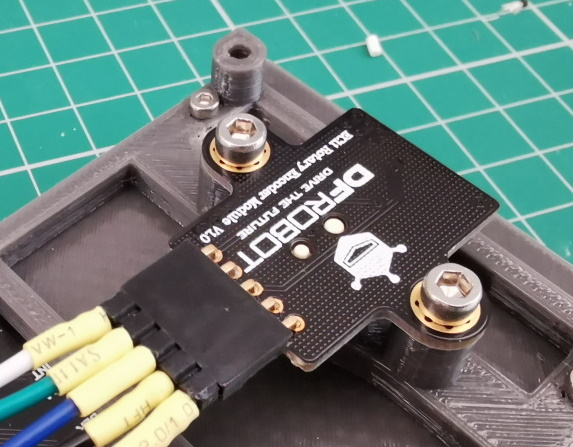
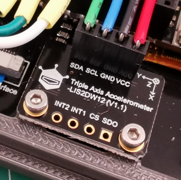
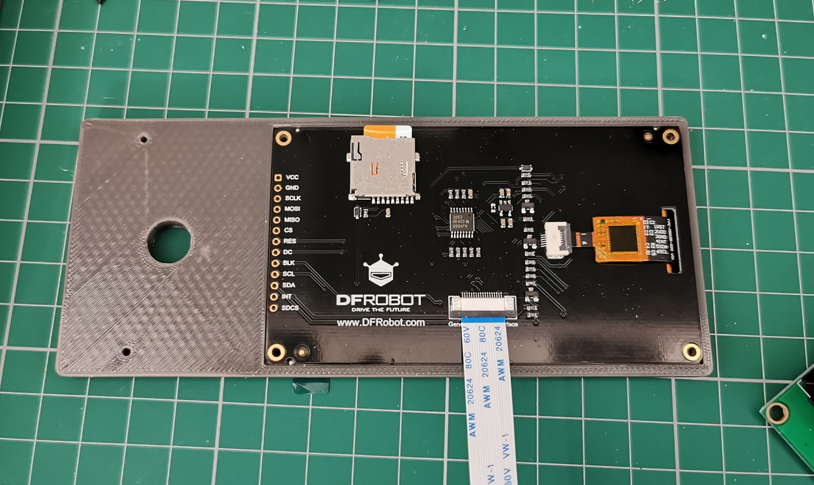
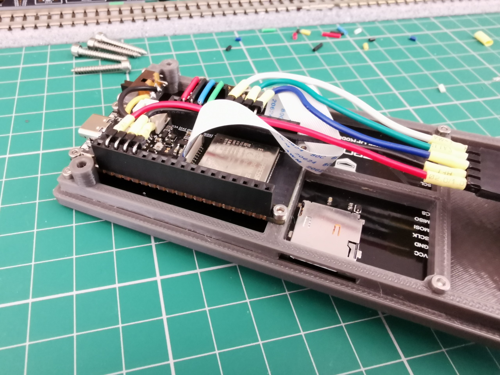
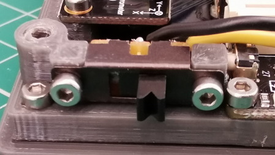
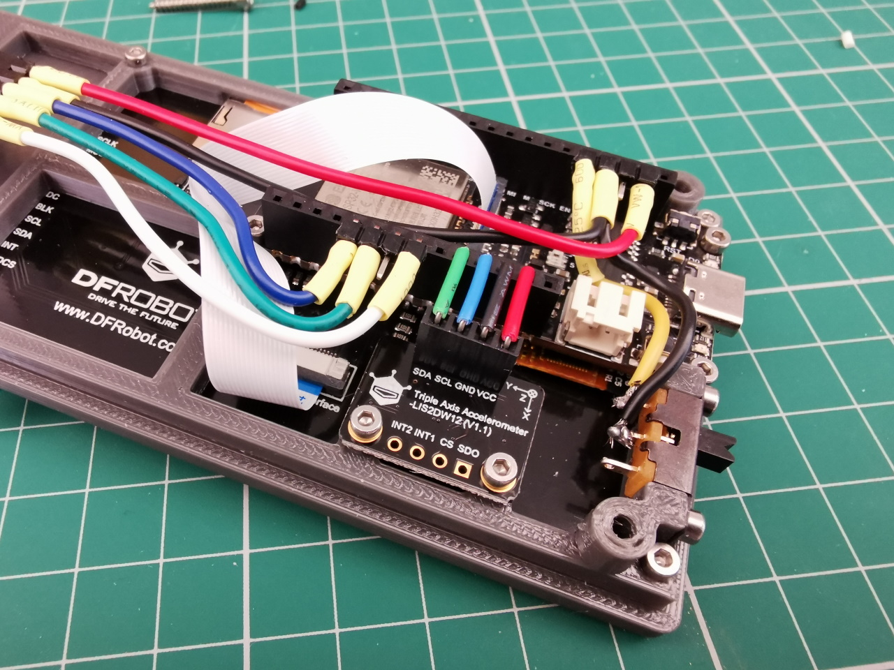
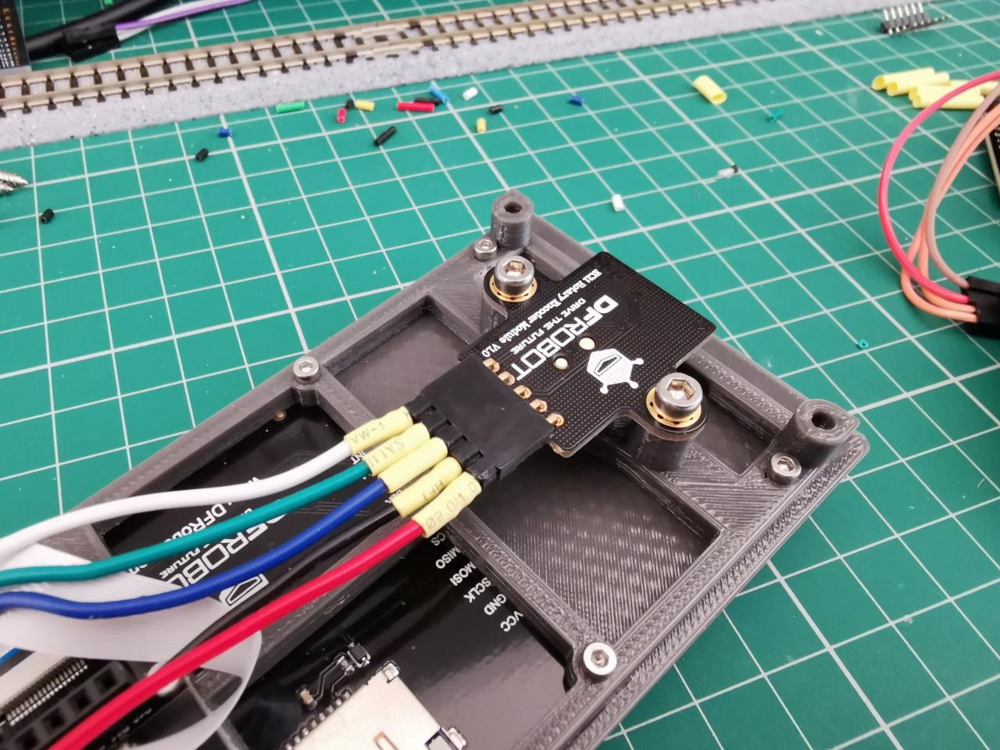
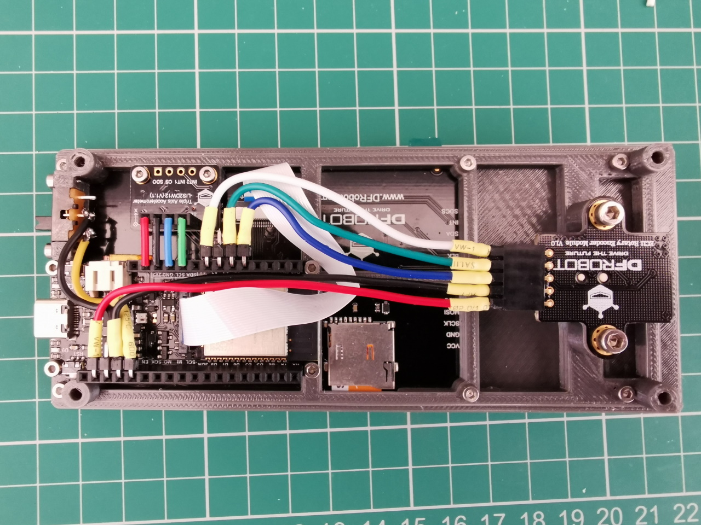
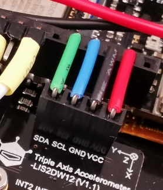
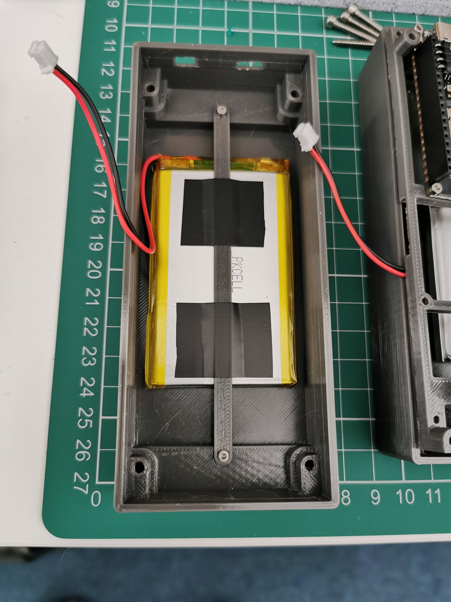

# Assembly

### ⚠ Before connecting the battery to the FireBeetle remember to check the wire polarity as not all batteries are the same ⚠

## Case
The case is made of 5 3D printed parts.
- **Body.stl** - The main case body
- **Frame.stl** - The frame the FireBeetle2, rotary encoder, power switch and optional accelerometer mount to
- **Top.stl** - The case top and display & frame mount
- **Dial.stl** - Dial for the rotary encoder
- **Battery Strap - 3000mah.stl** or **Battery Strap - 2000mah.stl** depending on what size battery

## Assembly

**Pre-assembly soldering** - Depending on how you prefer to attach the wires

I like to use header pins so used a female 90 degree header on the rotary encoder. You can then use a male header to solder the wires to (makes it so parts can be replaced if needed).

  

**Optional if using the accelerometer**\
Solder a female header to the accelerometer.
> Make sure to solder the header to the underside so the I2C pins are opposite the FireBeetle.

  

Start by copying the contents of the `sd` folder to the MicroSD card and insert into the display. This is easier to do now while access is still easy.
> * The files in the `/sd` directory should not exceed 4GB or 8GB in size; however a 16GB MicroSD card should work well.
> * The MicroSD card needs to be FAT32 formatted before the files contained in the `/sd` directory are copied to it.
> * After copying the `/sd` directory contents to the MicroSD card it should contain the file `default.json` and a directory named `icons` (which contains the icons for the Touchscreen use). e.g\
`D:\default.json`\
`D:\icons\bulb-off.bmp`\
`D:\icons\bulb-on.bmp`\
etc.\
Where `D:\` is the MicroSD card.

Attach the ribbon cable to the display and insert the display in to the top part of the case.

  

Attach the FireBeetle2 to the **Frame** using 4 M2x5 mm screws.

  

Attach the slide switch using 2 M2x5mm screws.

  

**Optional if using the accelerometer**\
Attach the accelerometer using 2 M2x5mm screws.

  

Attach the frame to the top using 6 M2x8mm screws, remember to pass the display ribbon cable through.

After the frame is attached you can now connect the ribbon cable to the FireBeetle.

Attach the rotary encoder to the frame using 2 M3x6mm screws

  

## Wiring

I soldered wires to 90 degree header pins with a bit of heatshrink.

> TIP: To help with soldering I cut off small pieces of brass tube (2mm OD, 0.25mm wall) to keep the wire steady. The brass tube can be cut by using a craft knife and applying pressure while rolling the tube back and forth.

  

> If using the accelerometer you'll need to share a GND pin.\
The picture above shows how I did it.

 ### Encoder
 - Encoder C = FireBeetle A3
 - Encoder B = FireBeetle A1
 - Encoder A = FireBeetle A0
 - Encoder VCC = FireBeetle 3v3
 - Encoder GND = FireBeetle GND
 ### FireBeetle2
 - FireBeetle GND = Switch
 - FireBeetle EN = Switch
 > One wire needs to go to the middle pin of the switch while the other can go to either side. It depends if you have a preference for which position is on/off.
 ### Accelerometer (optional)
 The I2C headers are directly opposite each other so if you've soldered on a female header the easiest option here is some solid core wire.
 

  

## Securing battery

I used some electrical tape to secure the battery to the strap.\
This can then be attached to the body using M2 screws.
* 2000mah battery - 2 M2x8mm screws
* 3000mah battery - 2 M2x5mm screws

  

## Final assembly

### ⚠ Before connecting the battery to the FireBeetle remember to check the wire polarity as not all batteries are the same ⚠

Connect the battery to the FireBeetle and insert the top section into the body.\
To allow clearance for the USB and power switch the top needs to be placed slightly back and slid forward.

The top can now be secured with 4 M3x20mm screws from the base.
