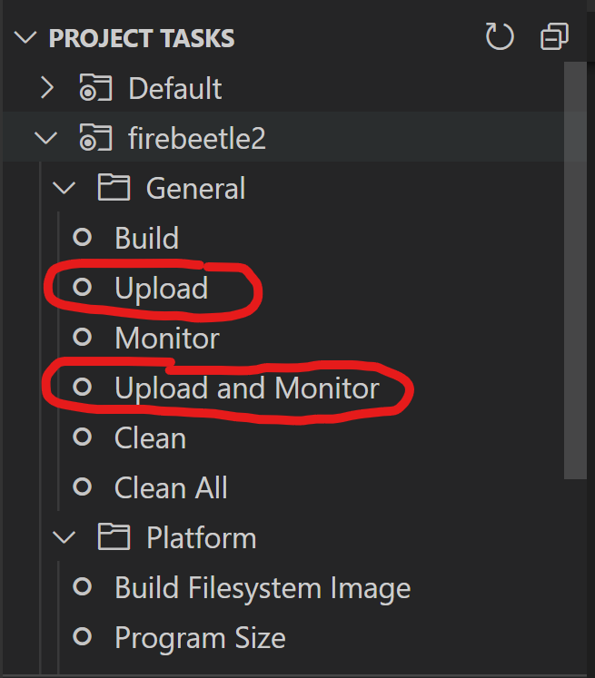

# Uploading the Code

Start by uploading the embedded file system.\
On the PlatformIO tasks list click the `Upload Filesystem Image` task.

  

## Uploading the code

Either of the options below will upload the code to the FireBeetle but **Upload and Monitor** can help with debugging any issues.

  

# Command Station

If you want some extra functionality you'll need to update your **Command Station**.\
This step is optional and the throttle will still function without it but it won't be able to query the **CS** for the current power states.

Included is a file named `myFilter.cpp`, this needs to be copied to the folder that contains the **Command Station** code and uploaded to your **Command Station**.