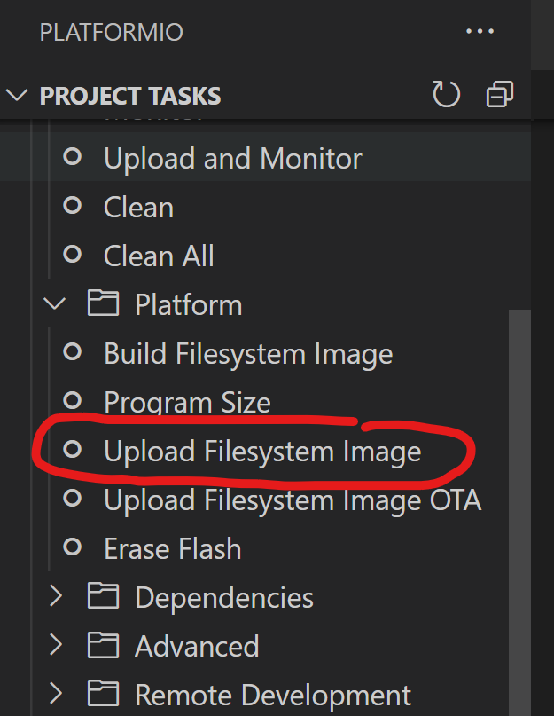

# Uploading the Code

Start by uploading the embedded file system.\
On the PlatformIO tasks list click the `Upload Filesystem Image` task.
<p align="center">
  
</p>

## Build Options
Some features and functionality are optional and can be toggled on/off with `build_flags` in the `platformio.ini` file by commenting/uncommenting the flags.

**Accelerometer** - If you've included an accelerometer board.
```ini
build_flags =
-DUSE_ACCELEROMETER ; Accelerometer enabled
; -DUSE_ACCELEROMETER ; Accelerometer disabled
```

**Mask Password** - By default the `T3 WiFi` display will show the password used to connect to your WiFi. If you don't want to show the password this option will mask it with `****`.
```ini
  build_flags =
	-DMASK_PASSWORD ; Mask the password
  ; -DMASK_PASSWORD ; Show the password
  ```

## Uploading the code

After setting any build options you require the throttle code can be uploaded.\
Either of the options below will upload the code to the FireBeetle but **Upload and Monitor** can help with debugging any issues.
<p align="center">
  
</p>

On first compile a random access point name and password will be generated. These are the network details for the throttles built in WiFi.\
*(This can be changed if you want to set your own later on `include\ThrottleWiFiSettings.h`)*.\
*These can be viewed on the throttle so there's no need to remember them.*

# Command Station

If you want some extra functionality you'll need to update your **Command Station**.\
This step is optional and the throttle will still function without it but it won't be able to query the **CS** for the current power states.

Included is a file named `myFilter.cpp`, this needs to be copied to the folder that contains the **Command Station** code and uploaded to your **Command Station**.