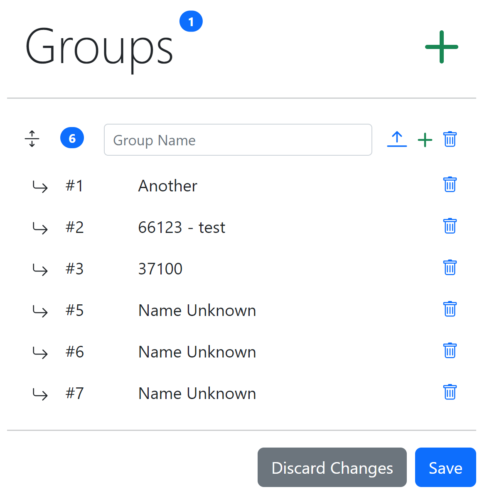

> Remember, to manage locos you'll need to start and connect to the web server on the throttle.\
Refer to [Throttle setup](/docs/setup.md).

# Managing Locos

Click the green **+** icon to add a new loco config or click the pencil icon on an existing loco to edit it.

  

A window will open where you can enter the details of the new loco.
* Enter the loco address in the field with the **#**.
* Enter a loco name in the **Loco Name** field, this is just for your reference so can be anything *(Max 20 characters)*.
* The last option is a dropdown, by default a loco will have buttons for functions 0-28 but you can create re-usable function sets or have a custom function set per loco.

  

# Custom Functions

Each loco can have a custom function set.\
If you have more than 8 rows of buttons paging will be enabled and there will be 7 rows per page.\
Each row can have a max of 4 buttons.

  

Start by dragging in a row, click and hold the button with the arrows then drag it into the black area.

  

You can now drag in a button, click and hold the middle blue button and drag it on to the row.\
New buttons will use the next highest available fn #.

  

Clicking the button will expand it so you can change the FN number and if it's a latching function or not.

  

After making any changes remember to click the green tick icon so the changes are saved.\
If you've made changes you wan't to discard then click the red **X**.

For more advanced options click the icon to the left of the FN number.

From here you can set the button labels, colours and icons for **Idle** and **Pressed**.\
Clicking the icon circled in red will toggle between the **Idle** and **Pressed** states so you can preview.

> Click an icon to select it, click it again to deselect it.

  

Rows can be dragged and reordered by clicking and holding the below icon that is at the end of each row.

  

Buttons can be moved between rows by clicking and holding the dragging between rows.

> Remember a row can have a max of 4 buttons

# Function Sets

Reusable function sets can also be created.\
This is useful if you want to create a function set for a specific decoder that's used in multiple locos.

The function set name is for your reference.\
This will be the name that will appear in the dropdown when managing a loco as above.

Functions are created as per the instructions above.

  

> There's also an upload icon (next to the +) so if a new decoder function set gets added to GitHub you can upload it without needing to take the SD card out.

# Groups

Here you can create loco groups that will show when the **By Group** button is pressed on the throttle menu.

Each group on the throttle will display as a button.\
Pressing a group button will then list the locos within it.\
You can then press a loco button to control that loco.

To add a new group click the large green **+** icon.\
This will add a new blank group.

  

Enter a name in the `Group Name` field *(Max 20 characters)*.\
To add locos click the small green **+** icon on the group.\
This will open a new window where you can either enter loco addresses manually or select existing locos the throttle has a config for.

  

Click the **Select** button to add the locos to the group.

  

Locos in the group will be listed below.\
If the throttle has a loco config it'll use the name otherwise it will show as **Name Unknown**.

Locos in the group will appear in the same order on the throttle.\
They can be reordered by click holding a dragging.\
Loco groups can also be reordered by dragging.

To save on display space a loco group is loaded as collapsed by default.\
You can expand/collapse a group to show the locos by clicking the arrow icons.

  
  

# Icons

You can upload your own icons to use with the function buttons.

These need to be 24bit bitmaps with max dimensions of 30x30.

# Downloading/Uploading configs
Configs for locos, function sets and groups can be downloaded and uploaded.
An individual loco/function config can be downloaded by clicking the download icon to the left on the list.\
You can download all loco/function configs by clicking the download icon at the top of the list.\
Upload loco/function configs by clicking the upload icon at the top of the list, you can select single or multiple files to upload.\
(**Warning, Uploaded configs with the same addresses/names will overwrite any existing**).