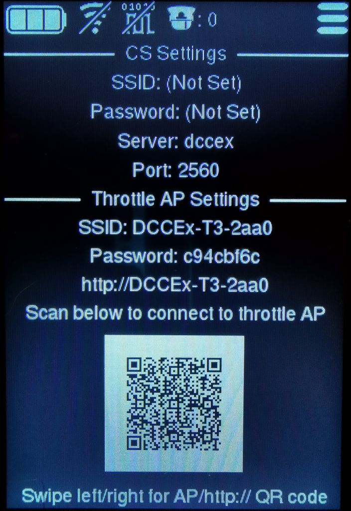

# Throttle Setup

To connect the throttle to the CS you'll need to start the WiFi server on the throttle, this is done from the main menu by touching the **T3 Web Server** button.

The display will update and show it's WiFi details, you'll need to connect to this to setup.

  

## CS Settings
* SSID - The SSID of the WiFi network the CS is on.
* Password - The WiFi network password, if set.
* Server - The CS server address. This can be a hostname or IP.
* Port - The CS port.

## Throttle AP Settings
* SSID - This is the SSID of the throttle WiFi.
* Password - This is the password for the throttle WiFi.
* http:// - This is the website address for throttle management.

For convenience there's a QR code which can be scanned by a smartphone to connect to the throttle's WiFi.\
The QR code can be swipped left/right to provide a different QR code which will open the throttles built in web page.

> If you don't have smartphone you'll need access to a computer with WiFi so you can connect.

Open a web brower and type the throttle address.\
Once on the throttle web page go to the **Settings** tab.\
Depending on how you setup your **Command Station** you'll need to enter the **SSID** and **password** of your local WiFi or the **CS** WiFi.

* **If your CS is connected to your local WiFi**\
The **server** and **port** are `dccex` and `2560` by default, you'll only need to change these if you changed them on your Command Station.
* **If your CS is in AP mode**\
The server will normally be this IP `192.168.4.1` and the port will still be `2560` unless you specified a different one.

Click save to remember the settings, the throttle will now try to connect to the CS.\
If connection is successful the icons will update

|   |   |   |   |
|---|---|---|---|
| 
 WiFi not connected
 | 
 WiFi connected
 | 
 CS not connected
 | 
 CS connected
 |
