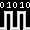

# Throttle Setup

> To manage locos, groups, icons & CS settings you'll need to be on the **T3 WiFi** display so the throttle website is accessible.

---

To connect the throttle to the CS you'll need to enter the WiFi settings, this is done from the **T3 WiFi** button on the main menu.

When on the **T3 WiFi** display you can touch any of the **CS Settings** labels to show a keyboard/keypad where you can enter the settings directly.

You can also connect to the throttles own WiFi and website (**AP Settings**) where you can enter the **CS Settings**.

## WiFi Settings
* SSID - The SSID of the WiFi network the CS is on *(Touch to show a keyboard)*.
* Password - The WiFi network password, if set *(Touch to show a keyboard)*.
* IP: The IP given to the throttle by the WiFi network.

## CS Settings
* Server - The CS server address. This can be a hostname or IP *(Touch to show a keyboard)*.
* Port - The CS port *(Touch to show a keypad)*.

## Throttle AP Settings
* SSID - This is the SSID of the throttle WiFi.
* Password - This is the password for the throttle WiFi.
* http:// - This is the website address for throttle management.

For convenience there's a QR code which can be scanned by a smartphone to connect to the throttle's WiFi.\
The QR code can be swipped left/right to provide a different QR code which will open the throttles built in web page.

> If you don't have smartphone you'll need access to a computer with WiFi so you can connect.

---

When the throttle is connected to your local WiFi or you're connected to the throttles own WiFi you can load the management website. 

Open a web brower and type the throttle address.

If you still need to enter the CS settings go to the **Settings** tab.\
Depending on how you setup your **Command Station** you'll need to enter the **SSID** and **password** of your local WiFi or the **CS** WiFi.

* **If your CS is connected to your local WiFi**\
The **server** and **port** are `dccex` and `2560` by default, you'll only need to change these if you changed them on your Command Station.
* **If your CS is in AP mode**\
The server will normally be this IP `192.168.4.1` and the port will still be `2560` unless you specified a different one.

Click save to remember the settings, the throttle will now try to connect to the CS.\
If connection is successful the icons will update

|   |   |   |   |
|---|---|---|---|
| 
 WiFi not connected
 | 
 WiFi connected
 | 
 CS not connected
 | 
 CS connected
 |
